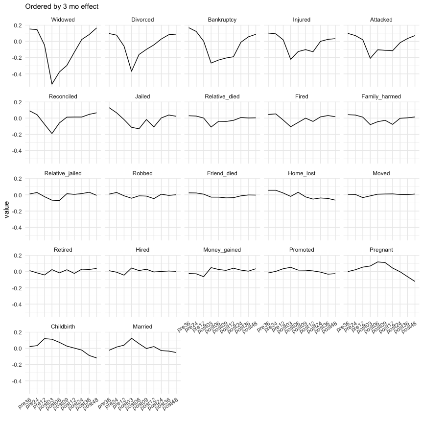

shit happens index
================

Estimating coefficients for measuring psychological distress resulting
from various life events

<br>

## Extension and validation of stressful life events schedule

Instruments for measuring the severity of psychological distress
resulting from recent life experiences were originally developed in the
1960s, and are used by clinicians today to identify and predict sources
of patient stress. The instrument consists of a checklist containing a
list of major life events (e.g., divorce, bankruptcy, death of a loved
one), and a weighting is assigned to each item that was determined by
asking research volunteers to anticipate the severity of stress that was
expected from its occurrence. However people are notoriously poor at
anticipating their emotional reaction to abstract events, and large
population-based surveys can now provide data which tracks self-reported
distress levels after survey respondants have experienced the life
event. This provides an opportunity to calculate weights based on
experienced distress levels rather than anticipated distress, and so can
provide a way to base clinical predictions on empirical evidence. Our
other work (`shit-happens`) has determined the causal effect of major
life events on clinically-relevant distress measures in large
population-based survey data, and results from this project will update
current clinical instruments to improve care in Australia.

#### Background

Stressful life events have been identified as a risk factor for a
variety of physical and mental illnesses such as cardiovascular disease,
cancer, metabolic syndrome, and depression (Bahri et al., 2019; Kessler,
1997; Slopen et al., 2011). Today, clinicians and epidemiologists often
assesses the impact of life-events through summed checklists that treat
events as equal (Dohrenwend, 2006; Gray et al., 2004; Wethington et al.,
1997). For example, the Life Events Checklist (LEC) (Gray et al., 2004)
is a checklist of events which are associated with the aetiology of
PTSD; responders must indicate the degree of exposure (e.g., directly
experienced vs witnessed vs heard about), but the LEC does not
distinguish the amount of distress from the event itself. A key feature
of such checklists is that all life events are treated as equivalent,
along with the implicit assumption that different life events have
equivalent impacts on distress.

The original instrument to measure life events was Holmes and Rahe’s
Social Readjustment Rating Scale (SRRS) (Holmes and Rahe, 1967), and
this included weights to distinguish and quantify the amount of stress
associated with each event. The publication of the SRRS led to an
enormous amount of research on the relationship between life events and
various types of illness onset (typically screening scales of
nonspecific psychological distress), with over 1000 papers using the
SRRS published in the first decade after its development (Kessler, 1997;
**holmes1979?**). It’s reputed advance was in adapting the
psychophysical procedure of magnitude estimation to quantify the
stressfulness of an event (Dohrenwend and Dohrenwend, 1974), which was
entirely based on the amount of stress anticipated by research
volunteers when imagining the event. Subsequent methodological critiques
pointed out the limitations of this method (Dohrenwend and Dohrenwend,
1974; Zimmerman, 1983); and within the set of fairly serious events
included in SRRS life event checklists, the use of differential weights
does not markedly increase the association between life event scales and
measures of distress (Tibubos et al., 2021; Zimmerman, 1983). Thus it is
not clear whether and how operationalization of a differential weight
improves the predictive value of life events checklists over and above
frequency or the sum of exposure, and this widely appreciated limitation
has led to the proliferation of summed checklists (Turner & Wheaton
1995).

> In addition, methodological studies of the SRRS (and the various
> checklists based on it) also demonstrated that negative events are
> much more powerful predictors of mental health outcomes than positive
> events (Zautra and Reich, 1983), and that distinctions along a number
> of other dimensions (e.g. amount of loss, amount of threat, degree of
> controllability of consequences of the event) do lead to substantial
> increases in the association between negative life event scales and
> measures of distress (Thoits 1983).

<br><br>

##### To do list

-   Add estimated prevalence of each event
-   Estimate weights controlling for age (decade), gender, other events
-   Estimate predictive value of events for subsequent MHi5 \< 54?

<br><br>

## Methods

``` r
mhi5 <- read_rds("data/mhi5_by_all_lifeevents.rds")

# This includes all events, but we may want to select events with MHi5 observations
# before and after the event (i.e., balanced)
```

``` r
unconditional_fit <- function(.df) {
  
  # this is the simplest model: zMHi5 ~ event_dummy + mMHi5 + (1|person) + (1|wave)
  # It includes effects for wave and person, but not age, sex, other events etc.
  # Variation in mean levels of MHi5 and the event itself are partitioned separately
  
  require(lme4)
  
  .df %>%
    group_by(xwaveid) %>%
    mutate(y = c(scale(ghmh))) %>%
    ungroup() %>%
    mutate(
      time = fct_relevel(time, "pre36", "pre24", "pre12"),
      y = replace_na(y, 0)
    ) -> df
  
  ghmh_m <- select(df, xwaveid, year, ghmh) %>%
    distinct() %>%
    group_by(xwaveid) %>%
    summarise(m = mean(ghmh)) %>%
    mutate(sm = c(scale(m)))
  
  df <- left_join(df, ghmh_m)
  
  lmer(y ~ 0 + time + m + (1|xwaveid) + (1|wave), data = df)
  
}

fits <- map(mhi5, 
            .f = ~unconditional_fit(.))

write_rds(fits, "results/lmm_fits.rds")
```

## Results

Standardized beta coefficients representing the amount of change in
MHi-5 scores around each life event are shown below.

##### Figure 1. Time-varying effects of different life events

``` r
fits <- read_rds("results/lmm_fits.rds")
```

<!-- --> <br><br>

The beta coefficients from these models were used to assign weightings
to each event at different time points: 12 mo prior to the event, 3 mo
post event, and 12 mo post event.

#### Table 1. Time-varying weights for life events


<br>

The impact of events on mental health (MHi-5 scores) varies by event and
by time. Consequently, the weighting of each event varies. For example,
death of spouse (`Widowed`) and divorce or separation (`Divorced`) are
the two worst events at 3 mo afterwards, however by 12 mo afterwards
`Bankruptcy` is the worst event, with `Widowed` equal second (along with
serious injury `Injured`) and `Divorced` is equal eighth and not
significantly different from zero (*p* \> .05).

Some events have a positive effect on mental health (MHi-5 scores) and
so are given a negative weighting in this scheme. Marriage, childbirth
and pregnancy all have negative weights up to 12 months before the event
and three months afterwards. At 12 months after these events, the weight
is not significantly different from zero (*p* \> .05), highlighting the
temporary emotional impact of these positive life events (nb. changes to
life satisfaction scores have longer impacts after these events, but not
considered here).

<br><br>

## Discussion

The use of generic weights rather than subjective weights is promoted on
the grounds that generic weights are *a priori* independent from the
experience of the event, and so can predict consequences of the stress
exposure such as the risk of poor health. Interestingly the
rank-ordering of life events assigned by diverse subgroups are often
highly correlated (*ρ* \> 0.9), suggesting a shared or generalizable
experience of stress, which also supports the use of generic weights.
Others have argued the generalizability of any life event scale will be
limited to the population on which the weights were developed (@
Dohrenwend and Dohrenwend, 1974; Zimmerman, 1983). The HILDA sample on
which our weights were developed was selected so as to be representative
of Australia, but we expect the weights would be equally applicable to
other developed Western nations.

<br>

##### Limitations

Events are broad and vaguely defined, and so may capture heterogeneity
in the response (e.g., divorce, vs divorce after a period of marital
conflict and infidelity) (Dohrenwend, 2006)

<br>

##### Strengths

Problems in defining and sampling the relevant population for stressful
life events are often present in life events research (see Dohrenwend
and Dohrenwend, 1974), but are minimised here by probabilistic sampling
of the Australian population in HILDA. Furthermore, the relationship
between a stressful life event and a health outcome can be interpreted
as causal when exposure to the event occurred for reasons that are
random with respect to the outcome (Kessler, 1997), which is the case
here under HILDA’s probabilistic sampling method. However selection bias
may still exist if some victims are less likely to report an event than
others (e.g., homelessness, sexual assault, or severely affected
sufferers).

<br><br>

## References

<div id="refs" class="references csl-bib-body hanging-indent">

<div id="ref-bahri2019relation" class="csl-entry">

Bahri, N., Fathi Najafi, T., Homaei Shandiz, F., Tohidinik, H.R.,
Khajavi, A., 2019. The relation between stressful life events and breast
cancer: A systematic review and meta-analysis of cohort studies. Breast
cancer research and treatment 176, 53–61.

</div>

<div id="ref-dohrenwend2006inventorying" class="csl-entry">

Dohrenwend, B.P., 2006. [Inventorying stressful life events as risk
factors for psychopathology: Toward resolution of the problem of
intracategory
variability.](https://www.ncbi.nlm.nih.gov/pmc/articles/PMC1584216/)
Psychological bulletin 132, 477.

</div>

<div id="ref-dohrenwend1974stressful" class="csl-entry">

Dohrenwend, B.S., Dohrenwend, B.P., 1974. Stressful life events: Their
nature and effects. John Wiley & Sons.

</div>

<div id="ref-gray2004psychometric" class="csl-entry">

Gray, M.J., Litz, B.T., Hsu, J.L., Lombardo, T.W., 2004. [Psychometric
properties of the life events
checklist](https://www.ncbi.nlm.nih.gov/pubmed/15486169). Assessment 11,
330–341.

</div>

<div id="ref-holmes1967social" class="csl-entry">

Holmes, T.H., Rahe, R.H., 1967. [The social readjustment rating
scale](https://www.sciencedirect.com/science/article/abs/pii/0022399967900104).
Journal of psychosomatic research 11, 213–218.

</div>

<div id="ref-kessler1997effects" class="csl-entry">

Kessler, R.C., 1997. [The effects of stressful life events on
depression](https://www.annualreviews.org/doi/full/10.1146/annurev.psych.48.1.191).
Annual review of psychology 48, 191–214.

</div>

<div id="ref-slopen2011sex" class="csl-entry">

Slopen, N., Williams, D.R., Fitzmaurice, G.M., Gilman, S.E., 2011. Sex,
stressful life events, and adult onset depression and alcohol
dependence: Are men and women equally vulnerable? Social Science &
Medicine 73, 615–622.

</div>

<div id="ref-tibubos2021frequency" class="csl-entry">

Tibubos, A.N., Burghardt, J., Klein, E.M., Brähler, E., Jünger, C.,
Michal, M., Wiltink, J., Wild, P.S., Münzel, T., Singer, S., others,
2021. [Frequency of stressful life events and associations with mental
health and general subjective health in the general
population](https://link.springer.com/article/10.1007/s10389-020-01204-3).
Journal of Public Health 29, 1071–1080.

</div>

<div id="ref-wethington1995interview" class="csl-entry">

Wethington, E., Brown, G.W., Kessler, R.C., 1997. Interview measurement
of stressful life events, in: Cohen, S., Kessler, R.C., Gordon, L.U.
(Eds.), Measuring Stress: A Guide for Health and Social Scientists.
Oxford University Press, Oxford, UK, pp. 59–79.

</div>

<div id="ref-zautra1983life" class="csl-entry">

Zautra, A.J., Reich, J.W., 1983. [Life events and perceptions of life
quality: Developments in a two-factor
approach](https://onlinelibrary.wiley.com/doi/abs/10.1002/1520-6629(198304)11:2%3C121::AID-JCOP2290110206%3E3.0.CO;2-V).
Journal of Community Psychology 11, 121–132.

</div>

<div id="ref-zimmerman1983methodological" class="csl-entry">

Zimmerman, M., 1983. [Methodological issues in the assessment of life
events: A review of issues and
research](https://www.sciencedirect.com/science/article/pii/0272735883900193).
Clinical Psychology Review 3, 339–370.

</div>

</div>
