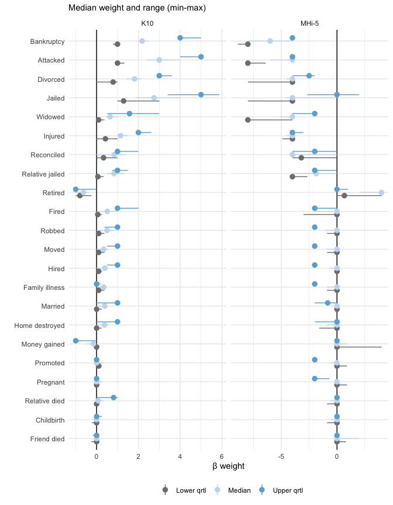

shit happens index
================

Estimating coefficients for measuring psychological distress resulting
from various life events

<br>

## Extension and validation of stressful life events schedule

Instruments for measuring the severity of psychological distress
resulting from recent life experiences were originally developed in the
1960s, and are used by clinicians today to identify and predict sources
of patient stress. The instrument consists of a checklist containing a
list of major life events (e.g., divorce, bankruptcy, death of a loved
one), and a weighting is assigned to each item that was determined by
asking research volunteers to anticipate the severity of stress that was
expected from its occurrence. However people are notoriously poor at
anticipating their emotional reaction to abstract events, and large
population-based surveys can now provide data which tracks self-reported
distress levels after survey respondants have experienced the life
event. This provides an opportunity to calculate weights based on
experienced distress levels rather than anticipated distress, and so can
provide a way to base clinical predictions on empirical evidence. Our
other work (Kettlewell et al., 2020) has determined the causal effect of
major life events on clinically-relevant distress measures in large
population-based survey data, and results from this project will update
current clinical instruments to improve care in Australia and elsewhere.

#### Background

Stressful life events have been identified as a risk factor for a
variety of physical and mental illnesses such as cardiovascular disease,
cancer, metabolic syndrome, and depression (Bahri, Fathi Najafi, Homaei
Shandiz, Tohidinik, & Khajavi, 2019; Kessler, 1997; Slopen, Williams,
Fitzmaurice, & Gilman, 2011). Today, clinicians and epidemiologists
often assesses the impact of life-events through summed checklists that
treat events as equal (B. P. Dohrenwend, 2006; Gray, Litz, Hsu, &
Lombardo, 2004; Wethington, Brown, & Kessler, 1997). For example, the
Life Events Checklist (LEC) (Gray et al., 2004) is a checklist of events
which are associated with the aetiology of PTSD; responders must
indicate the degree of exposure (e.g., directly experienced vs witnessed
vs heard about), but the LEC does not distinguish the amount of distress
from the event itself. A key feature of such checklists is that all life
events are treated as equivalent, along with the implicit assumption
that different life events have equivalent impacts on distress.

The original instrument to measure life events was Holmes and Rahe’s
Social Readjustment Rating Scale (SRRS) (Holmes & Rahe, 1967), and this
included weights to distinguish and quantify the amount of stress
associated with each event. The publication of the SRRS led to an
enormous amount of research on the relationship between life events and
various types of illness onset (typically screening scales of
nonspecific psychological distress), with over 1000 papers using the
SRRS published in the first decade after its development (Holmes, 1979;
Kessler, 1997). It’s reputed advance was in adapting the psychophysical
procedure of magnitude estimation to quantify the stressfulness of an
event (B. S. Dohrenwend & Dohrenwend, 1974), which was entirely based on
the amount of stress anticipated by research volunteers when imagining
the event. Subsequent methodological critiques pointed out the
limitations of this method (B. S. Dohrenwend & Dohrenwend, 1974;
Zimmerman, 1983); and within the set of fairly serious events included
in SRRS life event checklists, the use of differential weights does not
markedly increase the association between life event scales and measures
of distress (Tibubos et al., 2021; Zimmerman, 1983). Thus it is not
clear whether and how operationalization of a differential weight
improves the predictive value of life events checklists over and above
frequency or the sum of exposure, and this widely appreciated limitation
has led to the proliferation of summed checklists (Turner & Wheaton,
1997).

However our earlier research on the impact of major life events in
affective wellbeing in a large population-based survey of Australian
households between 2001 and 2016 clearly showed that different life
events have empirically different impacts on affective wellbeing and
mental health (Kettlewell et al., 2020). Events such as divorce, major
financial loss (e.g., bankruptcy) and death of a loved one (spouse or
child) had much larger effects on self-reported affective wellbeing 3 to
12 months later than events such as losing employment (e.g., fired),
moving home, or even home destroyed in natural disaster. Furthermore,
some events had a beneficial impact on affective wellbeing, such as
marriage or pregnancy. In general, our results based on reported
experience are consistent with methodological studies of the SRRS (and
the various checklists based on it) demonstrating that negative events
are much more powerful predictors of mental health outcomes than
positive events (Thoits, 1983; Zautra & Reich, 1983). It is therefore of
interest to provide weighted indexes of life events, based on experience
rather than (poorly) anticipated consequences, which large
population-based datasets such as HILDA can provide.

<br><br>

#### Aims

We aimed to provide clinicians and researchers with a better tool to
measure the impact of life events on mental health and the risk of
mental illness. First we provide the frequency of life events adjusted
for the Australian population to allow comparison with historical and
international estimates. Second we estimate the impact of each type of
life event on affective wellbeing from survey responses of people who
actually experienced the event. The impact is converted to a weight for
a life event checklist, from which a weighted or unweighted (summed)
score can be determined for each person. Finally we test the predictive
value of weighted and unweighted scores for future mental illness, since
highly stressful events are assumed to be a cause or risk factor for
mental illness such as depression and anxiety.

<br><br>

## Methods

We select all major life events in the HILDA 2020 dataset, which
encompasses the two decade period from 2001 to 2020. HILDA includes
comprehensive measures of subjective wellbeing, such as the SF-36 from
which the MHi-5 score, a measure of mental health, can be calculated.

The MHi-5 comprises of five items dealing with … etc.

We estimate the impact of each life event in a fixed effect regression
model of events on mental health (MHi-5 score). Temporal proximity to
the event were entered as dummy variables (pre 36 months, pre 24 months,
pre 12 months, post 3 months, post 6 months, post 9 months, post 12
months, post 24 months, post 36 months), along with varying effects of
survey wave and person. This is the simplest model, equivalent to the
“unconditional” model tested in Kettlewell et al. (2020), without
controls for other events.

``` r
events <- read_rds("data/lifeevents_by_all_years.rds")
# This includes all events, but we may want to select events with MHi5 observations
# before and after the event (i.e., balanced observations)

demographics <- read_rds("data/demographics_by_mhi5.rds")
weights <- read_rds("data/hilda_sample_weights.rds")
# Population weights from HILDA for frequency of events in Australia

named_events <- list(
  Widowed = "ledsc",    
  Divorced = "lesep",
  Bankruptcy = "lefnw",
  Jailed = "lejls",
  Attacked = "levio",
  Injured = "leins",
  Reconciled = "lercl", 
  Fired = "lefrd", 
  `Family illness` = "leinf",   
  Robbed = "lepcm",
  `Friend died` = "ledfr",
  `Relative died` = "ledrl",
  `Relative jailed` = "lejlf",
  `Home destroyed` = "ledhm",
  Moved = "lemvd",
  Hired = "lejob",
  Promoted = "leprm",
  Retired = "lertr",
  `Money gained` = "lefni",
  Pregnant = "leprg",
  Childbirth = "lebth",
  Married = "lemar"
)
```

``` r
unconditional_fit <- function(.df) {
  
  # this is the simplest model: zMHi5 ~ event_dummy + mMHi5 + (1|person) + (1|wave)
  # It includes effects for wave and person, but not age, sex, other events etc.
  # Variation in mean levels of MHi5 and the event itself are partitioned separately
  
  require(lme4)
  
  .df %>%
    group_by(xwaveid) %>%
    mutate(y = c(scale(ghmh))) %>%
    ungroup() %>%
    mutate(
      time = fct_relevel(time, "pre36", "pre24", "pre12"),
      y = replace_na(y, 0)
    ) -> df
  
  ghmh_m <- select(df, xwaveid, year, ghmh) %>%
    distinct() %>%
    group_by(xwaveid) %>%
    summarise(m = mean(ghmh)) %>%
    mutate(sm = c(scale(m)))
  
  df <- left_join(df, ghmh_m)
  
  lmer(y ~ 0 + time + m + (1|xwaveid) + (1|wave), data = df)
  
}

mhi5_by_events <- read_rds("data/mhi5_by_all_lifeevents.rds")

fits <- map(mhi5_by_events, 
            .f = ~unconditional_fit(.))
```

## Results

We present the population-weighted estimates of major life event
frequencies (adjusted for age, sex, region-of-State, labour force
status, marital status, and household composition) in Australia. For a
description of the weight-adjustment, see [Table 4.28 in the HILDA
manual](https://melbourneinstitute.unimelb.edu.au/hilda/for-data-users/user-manuals).

#### Frequency of major life events

##### Figure 1. Frequency of each major life event in Australia between 2001-2020

<!-- -->

<br>

The most frequent major life event is a illness or injury in a close
family member (Family illness) or moving home (Moved) for approximately
15 percent of Australians in any one-year period, while the least
frequent is being detained in jail (Jailed) for less than 1 percent. The
frequency of some events appear to have declined in the last two
decades, including family illness (or injury), moving home (Moved), and
starting a new job (Hired). There are no apparent increasing trends in
the frequency of any event. It is unclear whether these temporal trends
reflect real change in the Australian population or changes in the
survey sample as the respondents age over time.

<br><br>

Coefficients from the fixed effect regression of life events
representing the amount of change in MHi-5 scores around each life event
are shown below.

##### Figure 2. Time-varying effects of different life events

<!-- --> <br><br>

The beta coefficients from these models were used to assign weightings
to each event at different time points: 12 mo prior to the event, 3 mo
post event, and 12 mo post event.

#### Table 1. Time-varying weights for life events


<br>

The impact of events on mental health (MHi-5 scores) varies by event and
by time. Consequently, the weighting of each event varies. For example,
death of spouse (`Widowed`) and divorce or separation (`Divorced`) are
the two worst events at 3 mo afterwards, however by 12 mo afterwards
`Bankruptcy` is the worst event, with `Widowed` equal second (along with
serious injury `Injured`) and `Divorced` is equal eighth and not
significantly different from zero (*p* \> .05).

Some events have a positive effect on mental health (MHi-5 scores) and
so are given a negative weighting in this scheme. Marriage, childbirth
and pregnancy all have negative weights up to 12 months before the event
and three months afterwards. At 12 months after these events, the weight
is not significantly different from zero (*p* \> .05), highlighting the
temporary emotional impact of these positive life events (nb. changes to
life satisfaction scores have longer impacts after these events, but not
considered here).

<br><br>

##### Table 2. Bivariate associations with weighted scores

| unweighted |  MHi-5 | K10 risk category | K10 score | Health | Life-satisfaction |
|-----------:|-------:|------------------:|----------:|-------:|------------------:|
|      0.661 | -0.221 |             0.164 |     0.174 | -0.195 |            -0.185 |

<br>

The Pearson correlation between the weighted and unweighted scores was
moderate (*r* = 0.66), indicating less than 50 percent common variance
between the variables (*r^2* = 0.44). The weighted score was also
positively associated with the K10 risk category and K10 score. There
was only a slight negative correlation with MHi-5 score in the same year
(*r* = -0.22), which explained less than 5 percent of the variance in
the weighted score (*r^2* = .049).

<br><br>

#### Predictive value of weights

Our second aim was to determine the predictive value of using weighted
relative to unweighted scores. We estimated the predictive value of the
weighted scores for risk of a MHi-5 score \< 64 in the following year
(Cuijpers, Smits, Donker, Ten Have, & Graaf, 2009). This cut-off was
chosen because Batterham, Sunderland, Slade, Calear, & Carragher (2018)
has shown this is the optimal threshold for identifying individuals with
any DSM-V internalising disorder in a community sample.

Importantly, only years prior to the first MHi-5 event \< 64 (illness)
were included, in order to prevent any influence of the first illness on
life events (or the likelihood of reporting life events), or the
contemporaneous influence of a third variable on both. For this reason,
the estimates we report are not “contemporaneous associations” between
life events and illness, but instead the (1-year) lagged effect.

``` r
xvars <- events %>%
  gather("key", "val", lebth:levio) %>%
  left_join(select(shi_weights, key = code, weight), by = "key") %>% 
  mutate(shi_weight = val * weight) %>% 
  filter(!is.na(shi_weight)) %>%
  arrange(xwaveid, wave) %>%
  group_by(xwaveid, wave) %>%
  summarise(weighted = sum(shi_weight),
            unweighted = sum(val),
            .groups = "drop") 

illness <- demographics %>%
  select(xwaveid, wave, ghmh) %>% 
  mutate(ill = ghmh < 64) %>%
  group_by(xwaveid) %>%
  mutate(
    ill_sum = order_by(wave, cumsum(ill)), # count illness events
    ill_next_year = lead(ill, order_by = wave) # flag years which precede illness
  ) %>% 
  filter(ill_sum == 0) %>% # select years prior to first illness
  select(xwaveid, wave, ill_next_year) %>%
  ungroup()

modelframe <- left_join(illness, xvars, by = c("xwaveid", "wave")) %>%
  select(xwaveid, wave, ill_next_year, weighted, unweighted) %>%
  filter(wave != "a")
```

Our predictive modelling strategy was to first estimate the total effect
associated with the weighted and unweighted scores, and then partition
the total effect into between-person and within-person effects. The
total effect and the between-person effect are important estimates of
the predictive value of life events for future mental mental illness
across the population, however they are also affected/biased by
differences between people, such as gender, age, wealth or stable
personality traits (time-invariant features). We are mostly interested
in the within-person effect since that tells us whether recent life
events can play a role in future mental illness of an individual, after
removing any other (stable) differences between people. The
within-person estimate is thus more clincally relevant (nb. the
within-person estimates may still be subject to other (unmeasured)
time-varying confounds).

As the weights are a time-varying covariate, we used a multi-level model
with random intercepts for each person. To partition the total effect,
we employed within-person centering (equivalent to a fixed effects
model) to distinguish the within- and between-person contribution
separately. Thus the within-person estimates represent the strength of
the 1-year lagged association between the weights and mental illness,
after removing stable between-person differences in the level of the
predictor and the outcome (Ligthart-Smith, 2016; Rohrer & Murayama,
2021). It is unaffected by unobserved time-invariant confounders (an
important advantage), but it likewise cannot estimate the effect of
time-invariant variables in the context of the model such as gender or
other stable demographic features (these can be estimated by a
different/separate model if of interest).

The weighted and unweighted scores were standardized and included in the
same model in order to compare the relative importance of each. The
estimated terms as odds ratios (nb. `exponentiate=T`) are shown below:

##### Table 3. Comparing predictive value of weighted and unweighted life events

``` r
#### Total effects model ####
# Scale the weighted and unweighted scores over the whole sample
df <- modelframe %>%
  mutate(across(c(weighted, unweighted), ~c(scale(.))),
         ill_next_year = as.factor(ill_next_year))

totalfitall <- glmer(
  ill_next_year ~ weighted + unweighted + (1|xwaveid),
  data = df, 
  family = binomial)


#### Within vs Between model ####
# Within-person mean centering was performed to remove the influence of any 
# differences between people on the estimate. 
df.m <- modelframe %>%
  group_by(xwaveid) %>%
  summarise(
    weighted.between = mean(weighted, na.rm=T),
    unweighted.between = mean(unweighted, na.rm=T),
    .groups = "drop"
  ) %>%
  mutate(across(c(weighted.between, unweighted.between), ~c(scale(.))))

df <- modelframe %>%
  filter(!is.na(ill_next_year)) %>%
  group_by(xwaveid) %>%
  mutate(across(c(weighted, unweighted), ~c(scale(.)))) %>%
  ungroup() %>%
  replace_na(list(weighted = 0, unweighted = 0)) %>%
  left_join(df.m, by = "xwaveid") %>%
  mutate(ill_next_year = as.factor(ill_next_year)) %>%
  rename(weighted.within = weighted, unweighted.within = unweighted)

partfitall <- glmer(
  ill_next_year ~ weighted.within + weighted.between + 
    unweighted.within + unweighted.between + (1|xwaveid),
  data = df, 
  family = binomial)

bind_rows(
  tidy(totalfitall, effects = "fixed", conf.int=T, exponentiate=T) %>%
    mutate(effect = "Total"),
  tidy(partfitall, effects = "fixed", conf.int=T, exponentiate=T) %>%
    mutate(effect = "Partitioned")
) %>%
  filter(term != "(Intercept)") %>%
  mutate(across(where(is.double), ~round(., 3)))
```

| effect      | term               | estimate | std.error | statistic | p.value | conf.low | conf.high |
|:------------|:-------------------|---------:|----------:|----------:|--------:|---------:|----------:|
| Total       | weighted           |    1.072 |     0.021 |     3.545 |   0.000 |    1.032 |     1.115 |
| Total       | unweighted         |    1.124 |     0.024 |     5.541 |   0.000 |    1.078 |     1.171 |
| Partitioned | weighted.within    |    1.099 |     0.027 |     3.824 |   0.000 |    1.047 |     1.153 |
| Partitioned | weighted.between   |    0.987 |     0.038 |    -0.327 |   0.744 |    0.915 |     1.066 |
| Partitioned | unweighted.within  |    0.891 |     0.021 |    -4.817 |   0.000 |    0.850 |     0.934 |
| Partitioned | unweighted.between |    2.036 |     0.073 |    19.899 |   0.000 |    1.899 |     2.184 |

<br>

The total predictive value of both weighted and unweighted life event
scores was positive, the weighted and unweighted estimates had similar
total estimates and both predicted a higher likelihood of illness (*β*OR
\> 1, *p*s \< .05). The distribution of plausible total effects in each
case (95%CI) overlaps so there is not much evidence to distinguish the
importance of one over the other.

After partitioning the total predictive value into within- and
between-effects, the within-person effect of weighted scores was also
positive (*β*OR = 1.1±.027, *p* \< .05), and the 95% confidence
intervals indicated this was significantly higher than unweighted scores
(which were negative; *β*OR = 0.89±.021, *p* \< .05). Thus weighted
scores are better *positive* predictors of future mental illness than
unweighted scores when considering change within-person.

The between-person predictive value of unweighted scores was large and
positive (*β*OR = 2.04±.07, *p* \< .05) - indicating people who on
average have a higher score are at more risk of mental illness, however
this association may be affected by time-invariant third variables
(gender, age, ses, personality traits). The former within-person
estimates represent the most clinically-relevant effect, here indicating
a positive change in a person’s life event weighted score was associated
with a future risk of mental illness.

<br><Br>

#### Mental illness predictions

The regression coefficients presented above were standardized to allow
comparison of the effect size and precision, however they do not
indicate the probability of increased risk. Here we estimate the
predicted probability of risk over all values of weighted scores. We
estimate the total predicted probability and the within-person predicted
probability of a MHi-5 score \< 64 in the following year.

##### Figure 3. Weighted score predictions

<!-- -->

<br><br>

## Discussion

The use of generic weights rather than subjective weights is promoted on
the grounds that generic weights are *a priori* independent from the
experience of the event, and so can predict consequences of the stress
exposure such as the risk of poor health. Interestingly the
rank-ordering of life events assigned by diverse subgroups are often
highly correlated (*ρ* \> 0.9), suggesting a shared or generalizable
experience of stress, which also supports the use of generic weights.
Others have argued the generalizability of any life event scale will be
limited to the population on which the weights were developed (B. S.
Dohrenwend & Dohrenwend, 1974; Zimmerman, 1983). The HILDA sample on
which our weights were developed was selected to be representative of
Australia, but we expect the weights would be equally applicable to
other developed Western nations.

<br>

##### Limitations

Events are broad and vaguely defined, and so may capture heterogeneity
in the response (e.g., divorce, vs divorce after a period of marital
conflict and infidelity) (B. P. Dohrenwend, 2006)

<br>

##### Strengths

Problems in defining and sampling the relevant population for stressful
life events are often present in life events research (see B. S.
Dohrenwend & Dohrenwend, 1974), but are minimised here by probabilistic
sampling of the Australian population in HILDA. Furthermore, the
relationship between a stressful life event and a health outcome can be
interpreted as causal when exposure to the event occurred for reasons
that are random with respect to the outcome (Kessler, 1997), which is
the case here under HILDA’s probabilistic sampling method. However
selection bias may still exist if some victims are less likely to report
an event than others (e.g., homelessness, sexual assault, or severely
affected sufferers).

<br><br>

## References

<div id="refs" class="references csl-bib-body hanging-indent"
line-spacing="2">

<div id="ref-bahri2019relation" class="csl-entry">

Bahri, N., Fathi Najafi, T., Homaei Shandiz, F., Tohidinik, H. R., &
Khajavi, A. (2019). The relation between stressful life events and
breast cancer: A systematic review and meta-analysis of cohort studies.
*Breast Cancer Research and Treatment*, *176*(1), 53–61.
<https://doi.org/10.1007/s10549-019-05231-x>

</div>

<div id="ref-batterham2018assessing" class="csl-entry">

Batterham, P., Sunderland, M., Slade, T., Calear, A., & Carragher, N.
(2018). Assessing distress in the community: Psychometric properties and
crosswalk comparison of eight measures of psychological distress.
*Psychological Medicine*, *48*(8), 1316–1324.
<https://doi.org/10.1017/S0033291717002835>

</div>

<div id="ref-cuijpers2009screening" class="csl-entry">

Cuijpers, P., Smits, N., Donker, T., Ten Have, M., & Graaf, R. de.
(2009). Screening for mood and anxiety disorders with the five-item, the
three-item, and the two-item mental health inventory. *Psychiatry
Research*, *168*(3), 250–255.
<https://doi.org/10.1016/j.psychres.2008.05.012>

</div>

<div id="ref-dohrenwend2006inventorying" class="csl-entry">

Dohrenwend, B. P. (2006). Inventorying stressful life events as risk
factors for psychopathology: Toward resolution of the problem of
intracategory variability. *Psychological Bulletin*, *132*(3), 477.
<https://doi.org/10.1037/0033-2909.132.3.477>

</div>

<div id="ref-dohrenwend1974stressful" class="csl-entry">

Dohrenwend, B. S., & Dohrenwend, B. P. (1974). *Stressful life events:
Their nature and effects.* John Wiley & Sons.

</div>

<div id="ref-gray2004psychometric" class="csl-entry">

Gray, M. J., Litz, B. T., Hsu, J. L., & Lombardo, T. W. (2004).
Psychometric properties of the life events checklist. *Assessment*,
*11*(4), 330–341. <https://doi.org/10.1177/1073191104269954>

</div>

<div id="ref-holmes1979development" class="csl-entry">

Holmes, T. H. (1979). Development and application of a quantitative
measure of life change magnitude. *Stress and Mental Disorder*, 37–53.

</div>

<div id="ref-holmes1967social" class="csl-entry">

Holmes, T. H., & Rahe, R. H. (1967). The social readjustment rating
scale. *Journal of Psychosomatic Research*, *11*(2), 213–218.
<https://doi.org/10.1016/0022-3999(67)90010-4>

</div>

<div id="ref-kessler1997effects" class="csl-entry">

Kessler, R. C. (1997). The effects of stressful life events on
depression. *Annual Review of Psychology*, *48*(1), 191–214.
<https://doi.org/10.1146/annurev.psych.48.1.191>

</div>

<div id="ref-kettlewell2020differential" class="csl-entry">

Kettlewell, N., Morris, R. W., Ho, N., Cobb-Clark, D. A., Cripps, S., &
Glozier, N. (2020). The differential impact of major life events on
cognitive and affective wellbeing. *SSM-Population Health*, *10*,
100533. <https://doi.org/10.1016/j.ssmph.2019.100533>

</div>

<div id="ref-ligthart2016comparison" class="csl-entry">

Ligthart-Smith, A. (2016). *A comparison of linear mixed models that
include time-varying covariates*. Retrieved from
<https://vrs.amsi.org.au/wp-content/uploads/sites/78/2016/03/Ligthart-Smith_VRS-Report.pdf>

</div>

<div id="ref-rohrer2021these" class="csl-entry">

Rohrer, J. M., & Murayama, K. (2021). *These are not the effects you are
looking for: Causality and the within-/between-person distinction in
longitudinal data analysis*. Retrieved from
<https://psyarxiv.com/tg4vj/>

</div>

<div id="ref-slopen2011sex" class="csl-entry">

Slopen, N., Williams, D. R., Fitzmaurice, G. M., & Gilman, S. E. (2011).
Sex, stressful life events, and adult onset depression and alcohol
dependence: Are men and women equally vulnerable? *Social Science &
Medicine*, *73*(4), 615–622.
<https://doi.org/10.1016/j.socscimed.2011.06.022>

</div>

<div id="ref-thoits1983dimensions" class="csl-entry">

Thoits, P. A. (1983). Dimensions of life events that influence
psychological distress: An evaluation and synthesis of the literature.
*Psychosocial Stress*, 33–103.

</div>

<div id="ref-tibubos2021frequency" class="csl-entry">

Tibubos, A. N., Burghardt, J., Klein, E. M., Brähler, E., Jünger, C.,
Michal, M., … others. (2021). Frequency of stressful life events and
associations with mental health and general subjective health in the
general population. *Journal of Public Health*, *29*(5), 1071–1080.
<https://doi.org/10.1007/s10389-020-01204-3>

</div>

<div id="ref-turner1997checklist" class="csl-entry">

Turner, R. J., & Wheaton, B. (1997). Checklist measurement. *Measuring
Stress: A Guide for Health and Social Scientists*, 29.

</div>

<div id="ref-wethington1995interview" class="csl-entry">

Wethington, E., Brown, G. W., & Kessler, R. C. (1997). Interview
measurement of stressful life events. In S. Cohen, R. C. Kessler, & L.
U. Gordon (Eds.), *Measuring stress: A guide for health and social
scientists* (pp. 59–79). Oxford, UK: Oxford University Press.

</div>

<div id="ref-zautra1983life" class="csl-entry">

Zautra, A. J., & Reich, J. W. (1983). Life events and perceptions of
life quality: Developments in a two-factor approach. *Journal of
Community Psychology*, *11*(2), 121–132.
<https://doi.org/10.1002/1520-6629(198304)11:2%3C121::AID-JCOP2290110206%3E3.0.CO;2-V>

</div>

<div id="ref-zimmerman1983methodological" class="csl-entry">

Zimmerman, M. (1983). Methodological issues in the assessment of life
events: A review of issues and research. *Clinical Psychology Review*,
*3*(3), 339–370. <https://doi.org/10.1016/0272-7358(83)90019-3>

</div>

</div>
