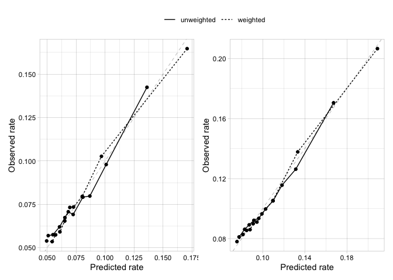
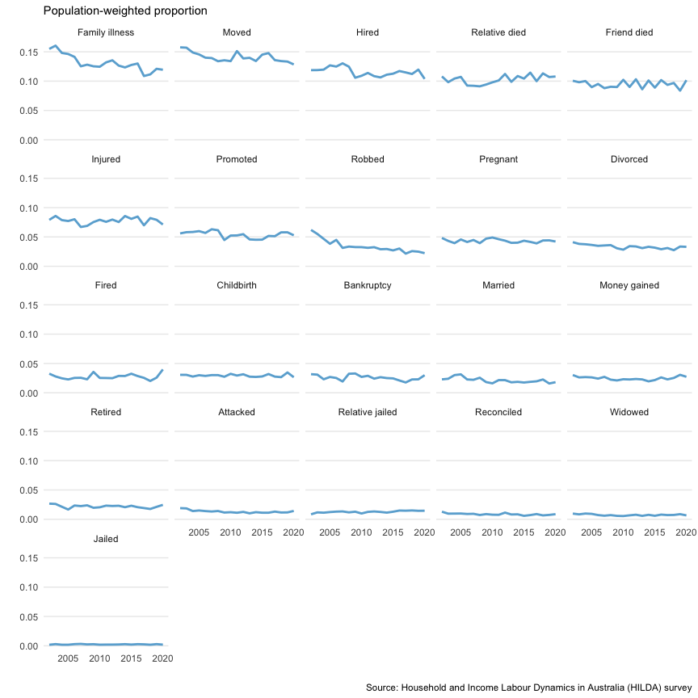

Evaluating the predictive value of affective weights to life-events
================

Extension and validation of stressful life events schedule

 

Instruments for measuring the severity of psychological distress
resulting from recent life experiences were originally developed in the
1960s, and are used by clinicians today to identify and predict sources
of patient stress. The instrument consists of a checklist containing a
list of major life events (e.g., divorce, bankruptcy, death of a loved
one), and a weighting is assigned to each item that was determined by
asking research volunteers to anticipate the severity of stress that was
expected from its occurrence. However people are notoriously poor at
anticipating their emotional reaction to abstract events, and large
population-based surveys can now provide data which tracks self-reported
affective responses and distress levels after survey respondants have
experienced the life event. This provides an opportunity to calculate
weights based on the experienced affect rather than anticipated
feelings, and so can provide a way to base predictions on empirical
evidence. Our other work (Kettlewell et al., 2020) has determined the
causal effect of major life events on affective wellbeing (mental
health), and so the present report evaluates and compares the predictive
value of a weighted life-events scale against an unweighted summed
score.

 

#### Background

Stressful life events have been identified as a risk factor for a
variety of physical and mental illnesses such as cardiovascular disease,
cancer, metabolic syndrome, and depression (Bahri, Fathi Najafi, Homaei
Shandiz, Tohidinik, & Khajavi, 2019; Kessler, 1997; Slopen, Williams,
Fitzmaurice, & Gilman, 2011). Today, clinicians and researchers often
assesses the impact of life-events through summed checklists that treat
events as equal (B. P. Dohrenwend, 2006; Gray, Litz, Hsu, & Lombardo,
2004; Wethington, Brown, & Kessler, 1997). For example, the Life Events
Checklist (LEC) (Gray et al., 2004) is a checklist of events which are
associated with the aetiology of PTSD; responders must indicate the
degree of exposure (e.g., directly experienced vs witnessed vs heard
about), but the LEC does not distinguish the amount of distress from the
event itself. A key feature of such checklists is that all life events
are treated as equivalent, along with the implicit assumption that
different life events have equivalent impacts on distress.

The original instrument to measure life events was Holmes and Rahe’s
Social Readjustment Rating Scale (SRRS) (Holmes & Rahe, 1967), and this
included weights to distinguish and quantify the amount of stress
associated with each event. The publication of the SRRS led to an
enormous amount of research on the relationship between life events and
various types of illness onset (typically screening scales of
nonspecific psychological distress), with over 1000 papers using the
SRRS published in the first decade after its development (Holmes, 1979;
Kessler, 1997). It’s reputed advance was in adapting the psychophysical
procedure of magnitude estimation to quantify the stressfulness of an
event (B. S. Dohrenwend & Dohrenwend, 1974), which was entirely based on
the amount of stress anticipated by research volunteers when imagining
the event. Subsequent methodological critiques pointed out the
limitations of this method (B. S. Dohrenwend & Dohrenwend, 1974;
Zimmerman, 1983); and within the set of fairly serious events included
in SRRS life event checklists, the use of differential weights does not
markedly increase the association between life event scales and measures
of distress (Tibubos et al., 2021; Zimmerman, 1983). Thus it is not
clear whether and how operationalization of a differential weight
improves the predictive value of life events checklists over and above
frequency or the sum of exposure, and this widely appreciated limitation
has led to the proliferation of summed checklists (Turner & Wheaton,
1997; but see T. Brugha, Bebbington, Tennant, & Hurry, 1985).

*(from Coyne & Downey, 1991. Ann. Rev. Psychology)*  
Whereas both minor and major life events are related to increases in
depressive symptoms, it appears that only serious life events requiring
long-term adjustment predict subsequent clinical depression (Brown &
Harris 1978). Thus, if one is interested in predicting depressive
symptoms, stronger correlations are obtained with a broad sampling of
major and minor events, and current life-event inventories seem to have
adopted a philosophy of “more is better.” Yet only about a dozen items
on a typical inventory are consistently related to clinical depression
(Dohrenwend et al 1986), and broader samplings of events produce an
underestimate of the strong association found with the dirty dozen.
Brugha et al (1985) found that 12 of 67 categories of life events
accounted for 77% of the events with etiological significance and that
these events alone entailed greater relative risk for depression than
the full list.

Our earlier research on the impact of major life events in affective
wellbeing in a large population-based survey of Australian households
between 2001 and 2016 clearly showed that different life events have
empirically different impacts on affective wellbeing and mental health
(Kettlewell et al., 2020). Events such as divorce, major financial loss
(e.g., bankruptcy) and death of a loved one (spouse or child) had much
larger effects on self-reported affective wellbeing 3 to 12 months later
than events such as losing employment (e.g., fired), moving home, or
even home destroyed in natural disaster, consistent with T. Brugha et
al. (1985) and T. S. Brugha & Cragg (1990). Furthermore, some events had
a beneficial impact on affective wellbeing, such as marriage or
pregnancy. In general, our results based on reported experience are
consistent with methodological studies of the SRRS (and the various
checklists based on it) demonstrating that negative events are much more
powerful predictors of mental health outcomes than positive events
(Thoits, 1983; Zautra & Reich, 1983). It is therefore valuable to
clinicians and researchers to provide a weighted index of life events,
based on experience rather than (poorly) anticipated consequences, since
highly stressful events are assumed to be a cause or risk factor for
mental illness such as depression and anxiety.

  

#### Aims

Our primary aim was to compare the predictive value of using weighted
life events relative to unweighted summed scores. We estimated the
predictive value of the weighted and unweighted scores for risk of
mental illness within the 12-months after the event. Risk of mental
illness was defined by low mental health (MHi-5 \< 64) or high
psychological distress \[K10 \> 21\]. While neither is a diagnostic
instrument, the probability is high that those who score beyond the
cut-point have a common mental disorder (i.e., over 85%, Andrews &
Slade, 2001; Hoeymans, Garssen, Westert, & Verhaak, 2004), and they have
good psychometric properties when identifying DSM disorders in a
community sample (AUC 0.877, Batterham, Sunderland, Slade, Calear, &
Carragher, 2018; Rumpf, Meyer, Hapke, & John, 2001).

The weights were the coefficients of risk estimated by logistic
regression from a (random) split-sample of respondents in the HILDA
survey over the entire sample (from 2001 to 2020) (*N* = 10,030). Each
regression included all life-events and wave controls, and so the
weights represent the *unique* risk (log odds) of each life event.
Predictive performance was assessed by measures of calibration and
discrimination, according to TRIPOD guidelines (Collins, Reitsma,
Altman, & Moons, 2015; Moons et al., 2015).

In addition, we conducted linear regressions and report the amount of
(linear) change in the underlying scales (K10 and MHi-5) predicted by
each life event at different quartiles of the response, as a way of
showing how risk of mental illness may vary as a function of baseline
mental health.

  

## Methods

 

#### Life events

We select all 22 major life events in the HILDA dataset, which
encompasses the two decade period from 2001 to 2020.

To describe the frequencies and probabilities of mental illness and life
events in the sample, we first calculated the probability of mental
illness risk after each life event for each year. These probabilities
are the
"),
and so are not adjusted for any other life-events. That is, they
represent the *total* (unconditional?) mental health risk of each
life-event in each year. However the HILDA population-weights were
applied in the calculation, so they are the population-weighted
probability in the HILDA sample.

 

#### Mental health

HILDA includes comprehensive measures of mental health, such as the
SF-36 from which the MHi-5 score, a measure of mental health, can be
calculated (McHorney, Ware Jr, Lu, & Sherbourne, 1994; McHorney, Ware
Jr, & Raczek, 1993; Ware Jr, 2000; Ware Jr & Sherbourne, 1992), as well
as the K10, a measure of psychological distress (Kessler et al., 2002,
2003).

The MHi-5 comprises of five items dealing with … etc .

The K10 comprises of ten items dealing with … etc .

The presence or absence of mental illness risk was defined by a K10
score \> 21 or a MHi-5 score \< 64 (Batterham et al., 2018). While
neither is a diagnostic instrument, the probability is high that those
who score above the K10 cut-point for very high distress have a common
mental disorder (i.e., over 85%, Andrews & Slade, 2001), and both have
good psychometric properties when identifying DSM-V disorders in a
community sample (K10 AUC 0.877 and MHi-5 AUC 0.847, Batterham et al.,
2018).

HILDA includes repeated measurements of people in the same household,
however the people in each household may vary from year to year. Each
person is an independent measurement, however our units of observation
were person-years. There were *n* = 199,111 person-years (from *n* =
24,302 people) in the MHi-5 data between 2001 to 2020. There were *n* =
75,450 person-years (from *n* = 20,060 people) in the K10 data between
2011 to 2020.

 

#### Model development and evaluation

We developed the weights for each life event using a logistic regression
of mental illness risk (presence or absence) on the complete set of life
events (plus yearly controls). Each regression was conducted in a
cross-validated design using hold-out sampling, which randomly split the
set of people in each data set into independent training and test sets.
The random split was carried out 10 times to establish the stability of
the resulting weights, and we report the median and range of weights
from the ten splits.

Model evaluation was performed by calculating discimrination and
calibration metrics for the ten independent random splits. Model
performance was summarised by the median and range of the resulting
metric scores for each split.

  

## Results

(demographic tables to be added later if neccesary)

  

#### Unconditional risk probability of each life-event

We present the population-weighted estimates of the probability of
mental illness risk given each major life event, adjusted for the
Australian population. The population weights provided in HILDA are
adjusted for age, sex, region-of-State, labour force status, marital
status, and household composition for each person and year in Australia
according to census data. For a description of the weight-adjustment,
see [Table 4.28 in the HILDA
manual](https://melbourneinstitute.unimelb.edu.au/hilda/for-data-users/user-manuals).

##### Table 1a. Probability of mental illness risk (K10 \> 21)

 

##### Table 1b. Probability of mental illness risk (MHi-5 \< 64)

  

#### Conditional risk weights for each life-event

Each logistic regression of mental illness risk on life events included
all life events as well as yearly controls, so the coefficients
represent the *unique* (conditional?) effect of each life event on the
log odds of risk.

##### Figure 1. Cross-validated weights of mental illness risk for life-events

<!-- -->

*Figure 1 legend: The median and range of the conditional weights from
the ten training models predicting either K10 \> 21 (black) or MHi-5 \<
64 (grey). Each weight represents the conditional effect of the
life-event on mental health risk from a logistic regression including
all life-events and wave controls.*

  

#### Linear mental health changes for each quartile

Quantile regression was conducted to compare the amount of change in
mental health score (K10 or MHi-5) between different quartiles of the
response variable. Each regression included all life events (and yearly
controls) so the coefficients
(s)
represent the amount of unique change after each life event in K10 or
MHi-5 units.

##### Figure 2. Linear regression weight of each life-event on mental health score

<!-- -->

*Figure 2 legend: The median and range of the coefficients from the ten
training models of each life event on K10 score (left panel) or MHi-5
score (right panel). Each weight represents the unique effect of the
life-event on mental health score from a quantile regression including
all life-events and yearly controls.*

  

### Discrimination

Discrimination is the ability of the predicted risk score to
differentiate between people at risk of mental illness from people who
are not at risk. We used *strictly proper scoring rules* (Merkle &
Steyvers, 2013) to compare the probablistic predictions from different
models, as these do not require an arbitrary probability threshold and
make full use of the entire range of predicted probabilities (Harrell et
al., 2015). A *proper* concordance- or c-index (AUC) was calculated to
represent the ability of the model to differentiate between those who
are or are not at risk of mental illness, where a value of 0.5
represents chance and 1 represents perfect discrimination. We also
calculate the root mean square error (equivalent to a *root* Brier score
in this two-class problem) and the mean log loss where lower scores are
better. Mean log loss gives more credit to extreme correct predictions,
but if the model assigns a certain (i.e., 0 or 1) but incorrect
probability to any prediction then it will score infinity (Kruppa, Liu,
Biau, et al., 2014; Kruppa, Liu, Diener, et al., 2014).

 

#### Risk of mental illness discrimination

##### Table 2. K10 risk model discrimination performance for weighted and unweighted life events

  

##### Table 3. MHi-5 risk model discrimination performance for weighted and unweighted life events

  

**Key points**

-   Discrimination by unweighted or weighted life events was low (i.e,
    AUC \~ 0.6)
-   Weighted life events provided better discrimination than unweighted
    in every independent test sample

  

#### Mental health score change discrimination

Quantile regression predictions were compared with OLS predictions to
determine whether differences in baseline levels of mental health
explained more variance in the effect of life events on mental health
score. Quantile and OLS models were compared for ten random splits and
the median and range of discrimination scores are presented.

`ccc` (concordance correlation coefficient) is a metric of both
consistency/correlation and accuracy, while metrics such as `rmse` (root
mean square error) are strictly for accuracy and metrics such as `rsq`
(r-squared) are strictly for consistency/correlation.

##### Table 4. K10 model discrimination for OLS and quantile regression

  

##### Table 5. MHi-5 model discrimination for OLS and quantile regression

 

**Key points**

-   Prediction by OLS is poor (r-squared \< 0.05)
-   The quantile regression with different predictions for each quartile
    provides moderate to good performance (e.g., r-squared \> 0.6)

 

  

### Calibration

Calibration refers to how closely the predicted mental illness risk
agrees with the observed mental illness risk (Moons et al., 2015), and
was assessed by calculating the ratio of predicted to observed risk over
low to high risk deciles in our dataset. Calibration is better as the
ratio approaches 1:1. The quality of the risk score predictions was
assessed by calculating risk scores in each each of the ten independent
(random split) test sets, and then plotting the mean observed
proportions versus mean predicted probabilities across deciles.

##### Figure 3.

<!-- -->

  

**Key points**

-   Calibration is very similar between weighted and unweighted life
    events (dotted line vs solid line)
-   Calibration is very similar between K10 and MHi-5 risk of mental
    illness (left vs right panel)

  

#### To do

1.  We could likely improve the risk weights by calculating them for
    each K10 risk category  
2.  Net reclassication improvement (NRI) is the net proportion of events
    reclassified correctly plus the net proportion of nonevents
    reclassified correctly
3.  Reclassification table across different risk categories (show how
    many individuals are reclassified from low to high risk)
4.  Number needed to treat (NNT) improvement

*(below could be added somewhere)*  
We also report (improper) classification accuracy metrics which may be
more familiar in a clinical context such as sensitivity, specificity and
number-needed-to-treat (NNT). The NNT is the average number of patients
who need to be treated to prevent one additional bad outcome (e.g. the
number of patients that need to be treated for one of them to benefit
compared with a control in a clinical trial). It is defined as the
inverse of the absolute risk reduction: NNT = 1 / (*I*u —
*I*e), where *I*e is the incidence in the treated
(exposed) group, and *I*u is the incidence in the control
(unexposed) group. However in this diagnostic/classification context it
isn’t clear what would represent that quantity. The inverse of the
Youden index (1/j) has been defined as the “number needed to diagnose”
(NND), that is, the number of patients who need to be examined in order
to correctly detect one person with the disease of interest in a study
population of persons with and without the known disease (Linn & Grunau,
2006). The same authors also proposed a predictive summary index (PSI =
PPV + NPV - 1) to represent the gain in certainty of diagnosis. It’s
inverse (1/PSI) represents the number of patients who need to be
examined in order to correctly *predict* the diagnosis of one person
(NNP). Whilst NND is insensitive to variation in disease prevalence,
since it depends entirely on sensitivity and specificity, NNP is
dependent on prevalence and therefore may be a better descriptor of
diagnostic tests in patient populations with different prevalence of
disease.

  

## Discussion

Our study provided frequencies of major life events in Australia for a
large sample of the population. Based on the large and representative
data set, these results represent reliable data without common selection
bias for specific subpopulations, which is necessary for planning and
designing public health services.

We also report the predictive associations between weighted and
unweighted life events and the risk of mental illness. The use of
weights in life event scales has been debated since 1960s. Originally
generic weights rather than subjective weights were promoted on the
grounds that generic weights are *a priori* independent from the
experience of the event, and so can predict consequences of the stress
exposure such as the risk of poor health. Here we are proposing a set of
generic weights that are based on the average experience of the event
from an independent and representative sample of the population.

We demonstrate the use of these empirical weights improves the
predictive value of a life-event scale for mental illness risk, relative
to an unweighted scale, however both weighted and unweighted scales had
low discriminative performance with AUC generally not exceeding 0.6.
However it is likely the risk of mental illness after major life-events
varies with baseline mental health, and once this is captured then risk
weights can account for substantially more variation.

Problems in defining and sampling the relevant population for stressful
life events are often present in life events research (see B. S.
Dohrenwend & Dohrenwend, 1974), as *post-hoc* selection of people who
experienced a major life event is likely to result in biased estimates.
That is, people who experienced a significant response to the life event
are more likely to be selected by such post-hoc methods, even if only
because they are more likely to remember the event than someone who was
unperturbed. One strength of the present study is the use of
probabilistic sampling of the Australian population in HILDA, which
avoids any selection bias of the response. Furthermore, the relationship
between a stressful life event and a health outcome can be interpreted
as causal when exposure to the event occurred for reasons that are
random with respect to the outcome (Kessler, 1997), which is the case
here under HILDA’s probabilistic sampling method. However selection bias
may still exist if some victims are less likely to report an event than
others (e.g., homelessness, sexual assault, or severely affected
sufferers).

One limitation of using a life event schedule as employed here, is that
events are broad and vaguely defined. For instance, there may be
important differences in the response to divorce after an amicable
seperation versus after marital conflict or infidelity (B. P.
Dohrenwend, 2006). However estimating the population response to more
detailed events is difficult in the currently available datasets, in
which the items recording life events are broad and ill-defined for
pragmatic reasons.

  

## Supplementary

##### Figure S1. Frequency of each major life event in Australia between 2001-2020

<!-- -->

 

The most frequent major life event is a illness or injury in a close
family member (Family illness) or moving home (Moved) for approximately
15 percent of Australians in any one-year period, while the least
frequent is being detained in jail (Jailed) for less than 1 percent of
Australians. The frequency of some events appear to have declined in the
last two decades, including family illness (or injury), moving home
(Moved), and starting a new job (Hired). There are no apparent
increasing trends in the frequency of any event. It is unclear whether
these temporal trends reflect real change in the Australian population
or changes in the survey sample as the respondents age over time.

  

## References

Andrews, G., & Slade, T. (2001). Interpreting scores on the Kessler
psychological distress scale (K10). *Australian and New Zealand Journal
of Public Health*, *25*(6), 494–497.
<https://doi.org/10.1111/j.1467-842X.2001.tb00310.x>

Bahri, N., Fathi Najafi, T., Homaei Shandiz, F., Tohidinik, H. R., &
Khajavi, A. (2019). The relation between stressful life events and
breast cancer: A systematic review and meta-analysis of cohort studies.
*Breast Cancer Research and Treatment*, *176*(1), 53–61.
<https://doi.org/10.1007/s10549-019-05231-x>

Batterham, P., Sunderland, M., Slade, T., Calear, A., & Carragher, N.
(2018). Assessing distress in the community: Psychometric properties and
crosswalk comparison of eight measures of psychological distress.
*Psychological Medicine*, *48*(8), 1316–1324.
<https://doi.org/10.1017/S0033291717002835>

Brugha, T. S., & Cragg, D. (1990). The list of threatening experiences:
The reliability and validity of a brief life events questionnaire. *Acta
Psychiatrica Scandinavica*, *82*(1), 77–81.

Brugha, T., Bebbington, P., Tennant, C., & Hurry, J. (1985). The list of
threatening experiences: A subset of 12 life event categories with
considerable long-term contextual threat. *Psychological Medicine*,
*15*(1), 189–194.

Collins, G. S., Reitsma, J. B., Altman, D. G., & Moons, K. G. (2015).
Transparent reporting of a multivariable prediction model for individual
prognosis or diagnosis (TRIPOD): The TRIPOD statement. *Journal of
British Surgery*, *102*(3), 148–158. <https://doi.org/10.1002/bjs.9736>

Dohrenwend, B. P. (2006). Inventorying stressful life events as risk
factors for psychopathology: Toward resolution of the problem of
intracategory variability. *Psychological Bulletin*, *132*(3), 477.
<https://doi.org/10.1037/0033-2909.132.3.477>

Dohrenwend, B. S., & Dohrenwend, B. P. (1974). *Stressful life events:
Their nature and effects.* John Wiley & Sons.

Gray, M. J., Litz, B. T., Hsu, J. L., & Lombardo, T. W. (2004).
Psychometric properties of the life events checklist. *Assessment*,
*11*(4), 330–341. <https://doi.org/10.1177/1073191104269954>

Harrell, F. E.others. (2015). *Regression modeling strategies: With
applications to linear models, logistic regression, and survival
analysis* (Vol. 608). Springer.
<https://doi.org/10.1007/978-3-319-19425-7>

Hoeymans, N., Garssen, A. A., Westert, G. P., & Verhaak, P. F. (2004).
Measuring mental health of the dutch population: A comparison of the
GHQ-12 and the MHI-5. *Health and Quality of Life Outcomes*, *2*(1),
1–6. <https://doi.org/10.1186/1477-7525-2-23>

Holmes, T. H. (1979). Development and application of a quantitative
measure of life change magnitude. *Stress and Mental Disorder*, 37–53.

Holmes, T. H., & Rahe, R. H. (1967). The social readjustment rating
scale. *Journal of Psychosomatic Research*, *11*(2), 213–218.
<https://doi.org/10.1016/0022-3999(67)90010-4>

Kessler, R. C. (1997). The effects of stressful life events on
depression. *Annual Review of Psychology*, *48*(1), 191–214.
<https://doi.org/10.1146/annurev.psych.48.1.191>

Kessler, R. C., Andrews, G., Colpe, L. J., Hiripi, E., Mroczek, D. K.,
Normand, S.-L., … Zaslavsky, A. M. (2002). Short screening scales to
monitor population prevalences and trends in non-specific psychological
distress. *Psychological Medicine*, *32*(6), 959–976.
<https://doi.org/10.1017/S0033291702006074>

Kessler, R. C., Barker, P. R., Colpe, L. J., Epstein, J. F., Gfroerer,
J. C., Hiripi, E., … others. (2003). Screening for serious mental
illness in the general population. *Archives of General Psychiatry*,
*60*(2), 184–189. <https://doi.org/10.1001/archpsyc.60.2.184>

Kettlewell, N., Morris, R. W., Ho, N., Cobb-Clark, D. A., Cripps, S., &
Glozier, N. (2020). The differential impact of major life events on
cognitive and affective wellbeing. *SSM-Population Health*, *10*,
100533. <https://doi.org/10.1016/j.ssmph.2019.100533>

Kruppa, J., Liu, Y., Biau, G., Kohler, M., Koenig, I. R., Malley, J. D.,
& Ziegler, A. (2014). Probability estimation with machine learning
methods for dichotomous and multicategory outcome: theory. *Biometrical
Journal*, *56*(4), 534–563. <https://doi.org/10.1002/bimj.201300068>

Kruppa, J., Liu, Y., Diener, H.-C., Holste, T., Weimar, C., König, I.
R., & Ziegler, A. (2014). Probability estimation with machine learning
methods for dichotomous and multicategory outcome: applications.
*Biometrical Journal*, *56*(4), 564–583.
<https://doi.org/10.1002/bimj.201300077>

Linn, S., & Grunau, P. D. (2006). New patient-oriented summary measure
of net total gain in certainty for dichotomous diagnostic tests.
*Epidemiologic Perspectives & Innovations*, *3*(1), 1–9.
<https://doi.org/10.1186/1742-5573-3-11>

McHorney, C. A., Ware Jr, J. E., Lu, J. R., & Sherbourne, C. D. (1994).
The MOS 36-item short-form health survey (SF-36): III. Tests of data
quality, scaling assumptions, and reliability across diverse patient
groups. *Medical Care*, 40–66.

McHorney, C. A., Ware Jr, J. E., & Raczek, A. E. (1993). The MOS 36-item
short-form health survey (SF-36): II. Psychometric and clinical tests of
validity in measuring physical and mental health constructs. *Medical
Care*, 247–263.

Merkle, E. C., & Steyvers, M. (2013). Choosing a strictly proper scoring
rule. *Decision Analysis*, *10*(4), 292–304.
<https://doi.org/10.1287/deca.2013.0280>

Moons, K. G., Altman, D. G., Reitsma, J. B., Ioannidis, J. P.,
Macaskill, P., Steyerberg, E. W., … Collins, G. S. (2015). Transparent
reporting of a multivariable prediction model for individual prognosis
or diagnosis (TRIPOD): Explanation and elaboration. *Annals of Internal
Medicine*, *162*(1), W1–W73. <https://doi.org/10.7326/M14-0698>

Rumpf, H.-J., Meyer, C., Hapke, U., & John, U. (2001). Screening for
mental health: Validity of the MHI-5 using DSM-IV axis i psychiatric
disorders as gold standard. *Psychiatry Research*, *105*(3), 243–253.
<https://doi.org/10.1016/S0165-1781(01)00329-8>

Slopen, N., Williams, D. R., Fitzmaurice, G. M., & Gilman, S. E. (2011).
Sex, stressful life events, and adult onset depression and alcohol
dependence: Are men and women equally vulnerable? *Social Science &
Medicine*, *73*(4), 615–622.
<https://doi.org/10.1016/j.socscimed.2011.06.022>

Thoits, P. A. (1983). Dimensions of life events that influence
psychological distress: An evaluation and synthesis of the literature.
*Psychosocial Stress*, 33–103.

Tibubos, A. N., Burghardt, J., Klein, E. M., Brähler, E., Jünger, C.,
Michal, M., … others. (2021). Frequency of stressful life events and
associations with mental health and general subjective health in the
general population. *Journal of Public Health*, *29*(5), 1071–1080.
<https://doi.org/10.1007/s10389-020-01204-3>

Turner, R. J., & Wheaton, B. (1997). Checklist measurement. *Measuring
Stress: A Guide for Health and Social Scientists*, 29.

Ware Jr, J. E. (2000). SF-36 health survey update. *Spine*, *25*(24),
3130–3139.

Ware Jr, J. E., & Sherbourne, C. D. (1992). The MOS 36-item short-form
health survey (SF-36): I. Conceptual framework and item selection.
*Medical Care*, 473–483.

Wethington, E., Brown, G. W., & Kessler, R. C. (1997). Interview
measurement of stressful life events. In S. Cohen, R. C. Kessler, & L.
U. Gordon (Eds.), *Measuring stress: A guide for health and social
scientists* (pp. 59–79). Oxford, UK: Oxford University Press.

Zautra, A. J., & Reich, J. W. (1983). Life events and perceptions of
life quality: Developments in a two-factor approach. *Journal of
Community Psychology*, *11*(2), 121–132.
<https://doi.org/10.1002/1520-6629(198304)11:2%3C121::AID-JCOP2290110206%3E3.0.CO;2-V>

Zimmerman, M. (1983). Methodological issues in the assessment of life
events: A review of issues and research. *Clinical Psychology Review*,
*3*(3), 339–370. <https://doi.org/10.1016/0272-7358(83)90019-3>

